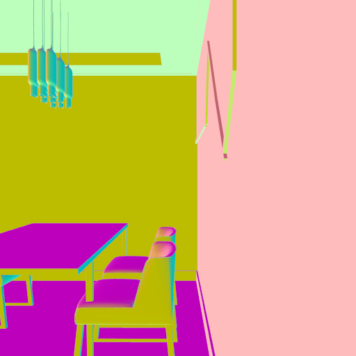
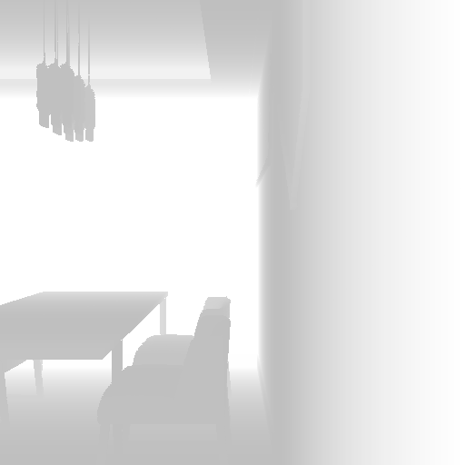
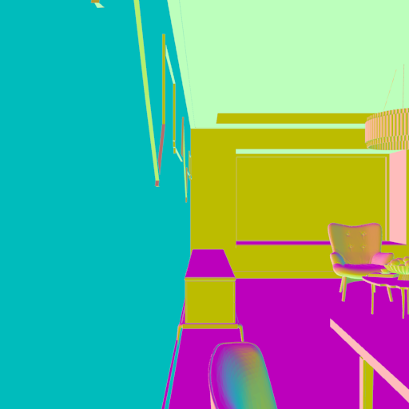
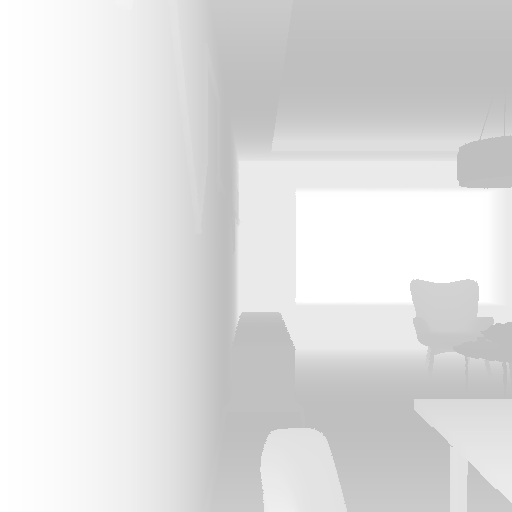

### 2022.4.21 
* **rewrite json2obj.py to process the updated 3D-FRONT (partial open sourceinterior finish with texture) and add new features.**

These scripts provide methods including generating scene objects from json files, point clouds of scenes, depth image and normal image of arbitrary view.

### Dependencies
  + ***numpy***
  + ***libigl***
  + ***trimesh***


# 1. JSON to OBJ
The json2obj.py script is used to output OBJ files from scene json file. The output OBJ files including walls and high-quality furniture shapes with informative texture.


### Install
We recommend using anaconda to install dependencies.
```
conda create -n front python=3.8
conda activate front
conda install -c conda-forge igl
conda install -c conda-forge trimesh
```
### Simple Usage
```
python json2obj.py --future_path=./3D-FUTURE-model --json_path=./3D-FRONT --texture_path=./3D-FRONT-texture --save_path=./outputs
```
  + ***future_path***: the directory of **3D-FUTURE-model**
  + ***json_path***: the directory of **3D-FRONT**
  + ***texture_path***: the directory of **3D-FRONT-texture**
  + ***save_path***: the directory of outputs

**Note:** 
The output structure is
```
├── house1
│   ├── room1
│   │   ├──wall
│   │   │   ├──[constructid].obj
│   │   ├──ceil
│   │   │   ├──[constructid].obj
│   │   ├──floor
│   │   │   ├──[constructid].obj
│   │   ├──others
│   │   │   ├──[constructid].obj
│   │   ├──meshes.obj ### all meshes (above) in this room 
│   │   ├──[category]_[model_id]_[idx].obj ### furniture objs
│   └── room2
├── house2
└── ...
```
There maybe some visual error if you use [meshlab](https://www.meshlab.net/) to open **meshes.obj**, alternatively, you can use [KeyShot](https://www.keyshot.com/) or [Blender](https://www.blender.org/) for visualization.

### Example

```
from scene import read_json
from constants import Config
Config.FUTURE_PATH = './3D-FUTURE-model'
Config.TEXTURE_PATH = './3D-FRONT-texture'

scene = read_json('test.json', Config.FUTURE_PATH)

# output all rooms.
scene.output('./output')

# output LivingRooms without ceil and only ouput Table models.
scene.output('./output', select_room_type = ['LivingRoom'], select_mesh_type=['wall','floor','others'], select_furniture_type = ['Table'])

# output room 'MasterBedroom-46277' only with Bed models, and center room to origin.
scene.output_with_room_id('./output', room_id='MasterBedroom-46277', center = Ture, select_furniture_type = ['Bed'])

### mesh type: ['wall', 'ceil', 'floor', 'other']
### furniture type: all categories in 'categories.py' in 3D-FUTURE-model
### room type: Figure 5 in 3D-FRONT paper.
```

  
# 2. Render depth and normal image

The render.py script is used to render depth and normal images for given camera parameters. It use the parameters generated by the algorithm in run.py.

 ### Usage

`python render.py --scene_path=./scene --json_path=./3D-FRONT --save_path=./outputs` 

  + ***scene_path***: the directory of scene objs generated by the json2obj.py
  + ***json_path***: the directory of 3D-FRONT json files

### examples





